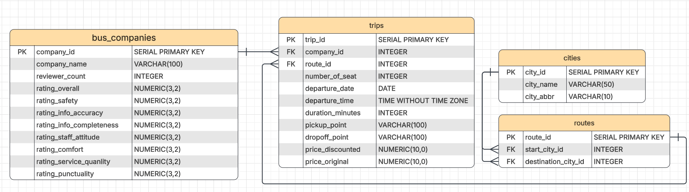
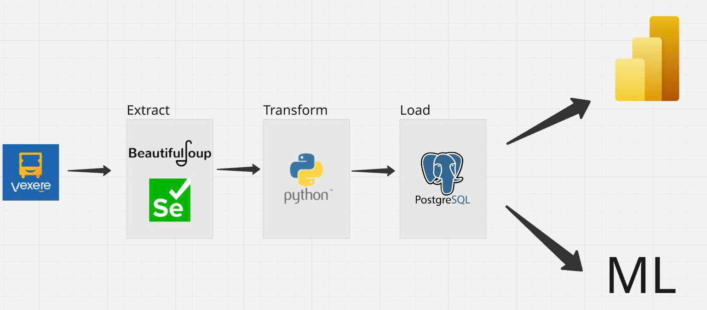

# Vexere ETL Pipeline - Hệ thống Thu thập & Phân tích Dữ liệu Xe khách

Dự án tự động crawl dữ liệu chuyến xe khách từ **Vexere.com**, làm sạch và lưu vào PostgreSQL, sau đó phân cụm chuyến xe theo giá và chất lượng dịch vụ bằng Machine Learning.

## 📌 Tổng quan hệ thống

### Pipeline gồm 3 giai đoạn chính:

1. **CRAWLING** → Thu thập dữ liệu thô từ Vexere
2. **CLEANING** → Làm sạch và chuẩn hóa dữ liệu
3. **LOADING** → Lưu vào PostgreSQL
4. **ANALYSIS** → Phân cụm và phân tích (Streamlit app)

---

## 🎯 Tính năng

### 1. Thu thập dữ liệu (Crawling)

- Tự động mở trình duyệt và điều hướng đến Vexere
- Nhập điểm đi, điểm đến, ngày khởi hành
- Tự động bấm "Xem thêm" để load thêm chuyến
- Thu thập thông tin chi tiết: giá vé, rating, thời gian, nhà xe, loại ghế
- Lưu dữ liệu thô vào `data/raw/`

**Files liên quan:**

- `src/extract/crawling.py` - Logic chính crawl
- `src/extract/trip_actions.py` - Các hành động tương tác
- `src/extract/trip_parser.py` - Parse HTML

### 2. Làm sạch dữ liệu (Cleaning)

- Chuẩn hóa giá vé (loại bỏ ký tự đặc biệt, đổi về số)
- Chuẩn hóa thời gian (format 24h)
- Parse ngày tháng (dd/mm/yyyy)
- Chuẩn hóa rating, loại ghế, tên nhà xe
- Tính toán thời lượng chuyến đi (phút)
- Loại bỏ dữ liệu trùng, lỗi, thiếu

**Files liên quan:**

- `src/transform/cleaning/cleaning.py`

### 3. Load vào Database (Loading)

- Tự động tạo city, route, company nếu chưa có
- Insert trip với đầy đủ foreign keys
- Lưu lịch sử rating theo từng tuyến
- Xử lý conflict và duplicate

**Files liên quan:**

- `src/load/loading.py`
- `src/database/db_manager.py`

### 4. Phân tích & Phân cụm (Streamlit App)

- **KMeans clustering** (K=3) phân chia chuyến xe thành 3 nhóm:
  - **Cụm 0**: "Ngon - Bổ - Rẻ" (chất lượng tốt, giá thấp)
  - **Cụm 1**: "Giá ảo - Chất lượng thấp" (giá cao nhưng dịch vụ kém)
  - **Cụm 2**: "Cao cấp - Đáng tiền" (giá cao, chất lượng cao)
- **Feature Engineering**: 12+ features được tạo ra:

  - `wilson_score` - Điểm đánh giá tin cậy
  - `log_price` - Log của giá thực tế
  - `fairness_index` - Chỉ số công bằng giá/chất lượng
  - `trust_score` - Điểm tin cậy (an toàn, đúng giờ, thông tin)
  - `service_score` - Điểm dịch vụ (thái độ, chất lượng, tiện nghi)

- **Visualization**: PCA 2D để trực quan hóa các cụm
- **Predict**: Nhập thông tin chuyến xe mới → dự đoán thuộc cụm nào

---

## 📂 Cấu trúc thư mục

```
project/
│
├── main.py                      # Pipeline chính (crawl → clean → load)
├── app.py                       # Streamlit app (phân cụm & phân tích)
├── routes.json                  # Danh sách tuyến đường cần crawl
├── requirements.txt             # Thư viện Python
│
├── data/
│   ├── raw/                     # Dữ liệu thô từ crawl (CSV)
│   └── processed/               # Dữ liệu đã làm sạch (CSV)
│
├── src/
│   ├── extract/                 # Module crawling
│   │   ├── crawling.py
│   │   ├── trip_actions.py
│   │   └── trip_parser.py
│   │
│   ├── transform/               # Module cleaning
│   │   └── cleaning/
│   │       └── cleaning.py
│   │
│   ├── load/                    # Module loading
│   │   └── loading.py
│   │
│   ├── database/                # Quản lý database
│   │   ├── db_manager.py
│   │   └── config.json          # ⚠️ Config PostgreSQL
│   │
│   └── utils/                   # Tiện ích
│
└── assets/
    └── readme_img/
        ├── pipeline_project.jpg
        └── image.png
```

---

## 🗄️ Database Schema



**Các bảng chính:**

- `cities` - Danh sách thành phố
- `routes` - Các tuyến đường (điểm đi → điểm đến)
- `companies` - Danh sách nhà xe
- `trips` - Thông tin chuyến xe
- `route_ratings` - Lịch sử rating theo tuyến

---

## 🚀 Hướng dẫn chạy dự án

### 1. Yêu cầu hệ thống

- Python 3.8+
- PostgreSQL 12+
- Chrome/Chromium browser
- ChromeDriver (tương thích với Chrome version)

### 2. Cài đặt thư viện

```bash
pip install -r requirements.txt
```

**Các thư viện chính:**

- `selenium` - Crawl dữ liệu
- `pandas`, `numpy` - Xử lý dữ liệu
- `psycopg2` - Kết nối PostgreSQL
- `streamlit` - Web app
- `scikit-learn` - Machine Learning
- `matplotlib` - Visualization

### 3. Cấu hình Database

Tạo file `src/database/config.json`:

```json
{
  "host": "localhost",
  "port": 5432,
  "database": "vexere_db",
  "user": "your_username",
  "password": "your_password"
}
```

Tạo database trong PostgreSQL:

```sql
CREATE DATABASE vexere_db;
```

### 4. Chuẩn bị danh sách tuyến

Chỉnh file `routes.json` với các tuyến cần crawl:

```json
[
  {
    "start_city": "Sài Gòn",
    "dest_city": "Đà Lạt"
  },
  {
    "start_city": "Hà Nội",
    "dest_city": "Hải Phòng"
  }
]
```

### 5. Chạy Pipeline ETL

```bash
python main.py
```

**Pipeline sẽ tự động:**

1. Đọc các tuyến trong `routes.json`
2. Crawl dữ liệu từng tuyến → lưu `data/raw/YYYYMMDD_HHMMSS_raw.csv`
3. Làm sạch dữ liệu → lưu `data/processed/YYYYMMDD_HHMMSS_cleaned.csv`
4. Load vào PostgreSQL

**Tham số có thể điều chỉnh trong `main.py`:**

```python
DAYSOFF = 2  # Số ngày kể từ hôm nay để crawl
```

### 6. Chạy Streamlit App (Phân tích & Phân cụm)

```bash
streamlit run app.py
```

**App sẽ mở tại:** `http://localhost:8501`

**Các tính năng:**

- Load dữ liệu từ `data/processed/` và train KMeans
- Hiển thị phân bố 3 cụm trên PCA 2D
- Nhập thông tin chuyến xe mới để dự đoán cụm
- Giải thích ý nghĩa từng cụm

---

## 📊 Flow Pipeline



---

## 💡 Giải thích code chính

### `main.py` - Pipeline ETL

```python
# 1. CRAWL - Thu thập dữ liệu thô
df = crawl_vexere(start_city, dest_city, days=DAYSOFF)
# → Lưu vào data/raw/

# 2. CLEAN - Làm sạch dữ liệu
df = clean_vexere(df)
# → Lưu vào data/processed/

# 3. LOAD - Nạp vào database
insert_trips_from_dataframe(db, df)
# → Insert vào PostgreSQL
```

### `app.py` - Streamlit App

```python
# 1. Load dữ liệu từ CSV trong data/processed/
df_train = load_csv_files("data/processed")

# 2. Feature Engineering
df_fe = feature_engineering(df_train)

# 3. Train KMeans (K=3)
model = KMeans(n_clusters=3)
model.fit(X_scaled)

# 4. Predict cho chuyến mới
new_cluster = model.predict(new_data_scaled)
```

---

## 📈 Ví dụ Feature Engineering

Các features được tạo ra trong `app.py`:

| Feature            | Công thức                                | Ý nghĩa             |
| ------------------ | ---------------------------------------- | ------------------- |
| `real_price`       | `price_discounted` hoặc `price_original` | Giá thực tế         |
| `log_price`        | `log(real_price + 1)`                    | Log giá (chuẩn hóa) |
| `wilson_score`     | Wilson confidence interval               | Điểm rating tin cậy |
| `service_score`    | Mean(staff, quality, comfort)            | Điểm dịch vụ        |
| `trust_score`      | Mean(safety, punctuality, accuracy)      | Điểm tin cậy        |
| `fairness_index`   | `wilson_score / sqrt(real_price)`        | Chỉ số công bằng    |
| `price_per_minute` | `real_price / duration_minutes`          | Giá theo phút       |
| `discount_rate`    | `1 - discounted/original`                | Tỷ lệ giảm giá      |

---

## 📝 License & Credits

- Dữ liệu được crawl từ [Vexere.com](https://vexere.com)
- Sử dụng cho mục đích học tập và nghiên cứu

---
